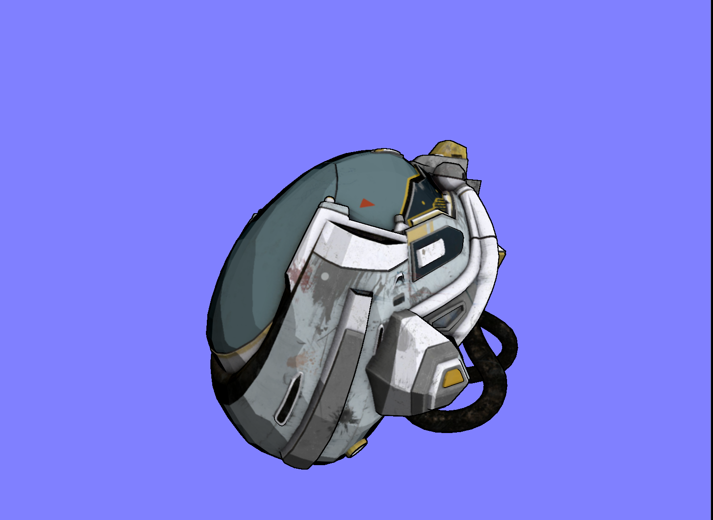

# Cell Shading

Cell shading is a post processing effect that takes a realistic image and makes it appear 
cartoonish through limiting the color palette and thick outlines.

## Screenshot


## Running

```sh
git clone https://github.com/skrpov/cell-shading --recursive
cd cell-shading
cmake -S . -B build -G Ninja
cmake --build build
./build/cell-shading ./assets/DamagedHelmet.glb
```
